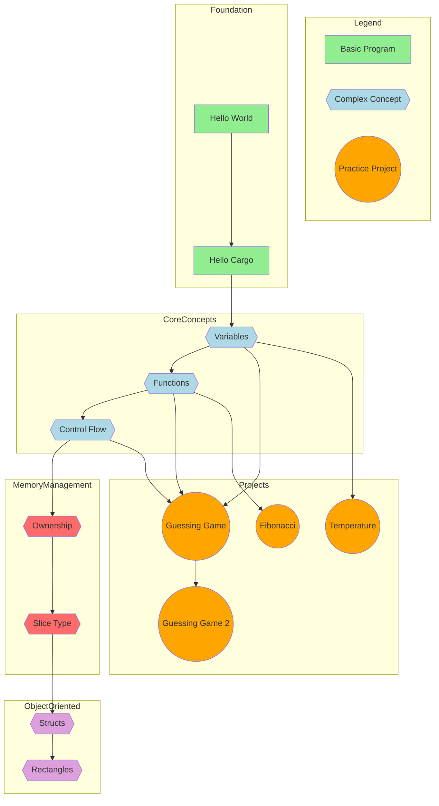

Bucket to learn rust languaje

## Projects Graph

```mermaid
graph TB
    subgraph Legend
        L1[Basic Program]
        L2{{Complex Concept}}
        L3((Practice Project))
        style L1 fill:#90EE90
        style L2 fill:#ADD8E6
        style L3 fill:#FFA500
    end

    subgraph Foundation
        HW[Hello World]:::basic
        HC[Hello Cargo]:::basic
    end

    subgraph CoreConcepts
        VAR{{Variables}}:::complex
        FUNC{{Functions}}:::complex
        CTRL{{Control Flow}}:::complex
    end

    subgraph MemoryManagement
        OWN{{Ownership}}:::memory
        SLICE{{Slice Type}}:::memory
    end

    subgraph ObjectOriented
        STR{{Structs}}:::oop
        RECT{{Rectangles}}:::oop
    end

    subgraph Projects
        GUESS((Guessing Game)):::practice
        GUESS2((Guessing Game 2)):::practice
        FIB((Fibonacci)):::practice
        TEMP((Temperature)):::practice
    end

    %% Basic Dependencies
    HW --> HC
    HC --> VAR
    VAR --> FUNC
    FUNC --> CTRL
    CTRL --> OWN
    OWN --> SLICE
    SLICE --> STR
    STR --> RECT

    %% Project Dependencies
    VAR --> GUESS
    FUNC --> GUESS
    CTRL --> GUESS
    GUESS --> GUESS2
    FUNC --> FIB
    VAR --> TEMP

    %% Styling
    classDef basic fill:#90EE90
    classDef complex fill:#ADD8E6
    classDef memory fill:#FF6B6B
    classDef oop fill:#DDA0DD
    classDef practice fill:#FFA500

    %% Click Events
    click HW "https://github.com/luchoss10/rust/blob/main/hello_world/main.rs"
    click HC "https://github.com/luchoss10/rust/blob/main/hello_cargo/src/main.rs"
    click VAR "https://github.com/luchoss10/rust/blob/main/commond_programing_concepts/variables/src/main.rs"
    click FUNC "https://github.com/luchoss10/rust/blob/main/commond_programing_concepts/functions/src/main.rs"
    click CTRL "https://github.com/luchoss10/rust/blob/main/control_flow/src/main.rs"
    click OWN "https://github.com/luchoss10/rust/blob/main/ownership/src/main.rs"
    click SLICE "https://github.com/luchoss10/rust/blob/main/slice_type/src/main.rs"
    click STR "https://github.com/luchoss10/rust/blob/main/structs/src/main.rs"
    click RECT "https://github.com/luchoss10/rust/blob/main/rectangles/src/main.rs"
    click GUESS "https://github.com/luchoss10/rust/blob/main/guessing_game/src/main.rs"
    click GUESS2 "https://github.com/luchoss10/rust/blob/main/guessing_game_2/src/main.rs"
    click FIB "https://github.com/luchoss10/rust/blob/main/fibonacci/src/main.rs"
    click TEMP "https://github.com/luchoss10/rust/blob/main/temperature/src/main.rs"
```

